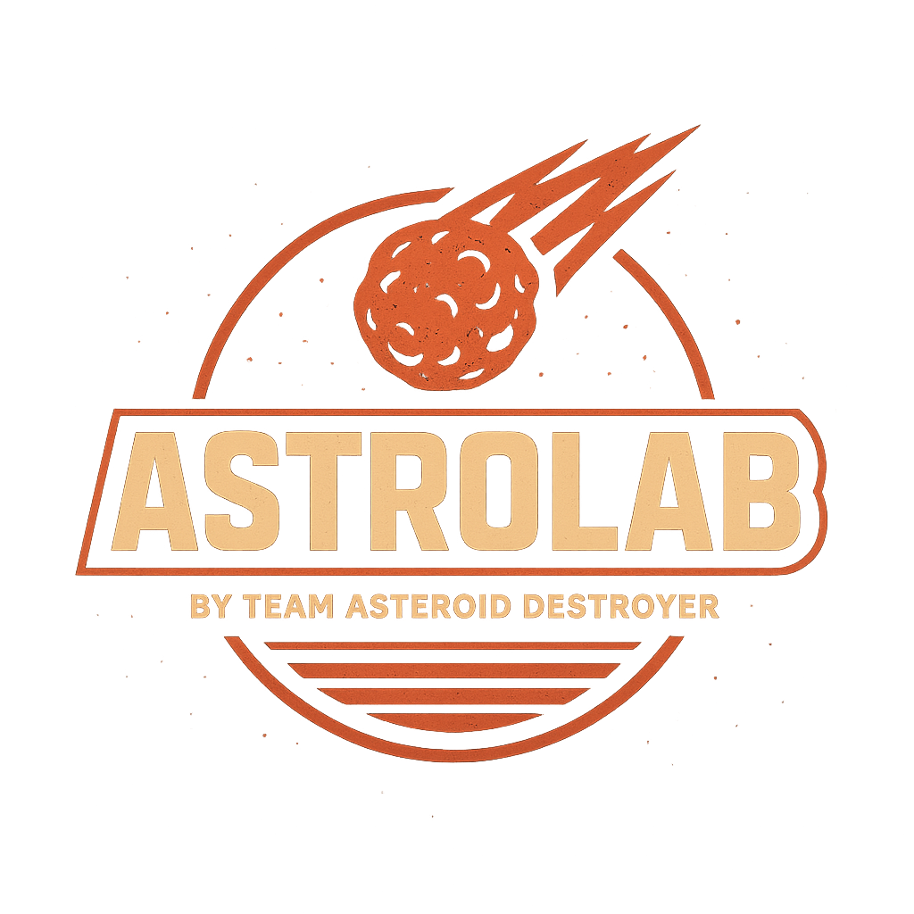

# 🌌 AstroLab  
*Turning Data into Defense – An Interactive Simulation Experience*  

<p align="center">
  
</p>  

<p align="center">
  
  
  
  
</p>

---

## 🚀 Overview  
**AstroLab** is an **interactive simulation + story-driven experience** designed for the **NASA Space Apps Challenge 2025 – Meteor Madness**.  

It blends **NASA’s asteroid data**, **AI-driven insights**, and **gamified storytelling** to raise awareness about the risks of meteor impacts and planetary defense.  

Players face **branching choices**, each leading to unique outcomes (good, bad, or unexpected).  
It’s not just a game — it’s a **data-powered planetary defense simulator**.  

---

## 🎯 Challenge – *Meteor Madness*  
- Visualize and simulate the risks of meteors and near-Earth objects (NEOs).  
- Use NASA data to create educational and engaging experiences.  
- Show how AI + gamification can improve public awareness of planetary defense.  

---

## 🧩 Features  
✨ **Dynamic Story Paths** – Every choice creates a different outcome (multiple endings).  
✨ **NASA Data Integration** – Real asteroid info from the NEO API powers scenarios.  
✨ **AI Assistant ("The Oracle")** – Mock AI (expandable later) provides survival predictions.  
✨ **3D Earth Backgrounds** – Earth imagery enhances immersion.  
✨ **Avatar Characters** – Pixel avatars guide the narrative, making it more engaging.  
✨ **Impact Simulation** – Predicts quakes, tsunamis, and disaster effects (placeholder APIs).  
✨ **Immersive Sound & Visuals** – Interactive sound effects + ambient music.  

---

## 🛰️ Data & APIs Used  
- **✅ NASA NEO (Near Earth Object) API** – Real asteroid properties (size, velocity, orbit).  
- **🟡 USGS Earthquake API** – Placeholder for seismic modeling.  
- **🟡 USGS DEM/Elevation Data** – Placeholder for crater + tsunami simulation.  
- **🟡 NASA Earth API** – For Earth imagery and background visuals.  
- **🧠 AI Oracle (Mock API)** – JSON-based predictive AI assistant.  

---

## 🎮 How It Works  
1. **Start Simulation** → A new asteroid threat is detected.  
2. **Player Choices** → Decide actions (deflect, evacuate, observe…).  
3. **AI Oracle Speaks** → AI gives risk estimates, survival chances, and outcomes.  
4. **Dynamic Endings** → Multiple scenarios:  
   - 🌍 *“Planet Saved”*  
   - 💥 *“Impact Disaster”*  
   - 🤯 *“Unexpected Twist”*  

---

## 🛠️ Tech Stack  
- **Frontend**: React (Lovable-generated UI)  
- **Styling**: TailwindCSS + retro/pixel assets  
- **Logic**: React hooks for story branching  
- **APIs**: NASA NEO API + placeholder/mocked APIs  
- **Media**: Sound effects, ambient tracks, character avatars  
- **Hosting**: Vercel 
---

## 📸 Screenshots & Demo  
| Story Choice | AI Oracle | Simulation View |  
|--------------|-----------|-----------------|  
|  |  |  |  

*(replace with actual screenshots)*  

---

## 👥 Team – *AstroLab*  
- 🌌 **Md. Radoan Bin Mahabubur** – Lead Developer,AI Logic, Game Systems & Backend
- 🎨 **MD Habibullah** – Design, Visual Assets, Story Writing & Presentation  

---
## 🌍 Future Improvements
- 🔮 Real AI integration (instead of mock API).

- 🌊 Global disaster modeling (impact tsunamis, climate effects).

- 🎮 Multiplayer planetary defense missions.

- 📱 Cross-platform deployment (Web + Mobile).

## 🏆 Hackathon Submission
- Event: NASA Space Apps Challenge 2025

- Challenge: Meteor Madness 🌠

- Status: Prototype (working demo + branching story simulation)

## 📜 License
MIT License – free to use, fork, and expand.

## 📂 Project Setup  
```bash
# Clone repo
git clone https://github.com/YourTeam/AstroLab.git

# Install dependencies
npm install

# Run development server
npm start


